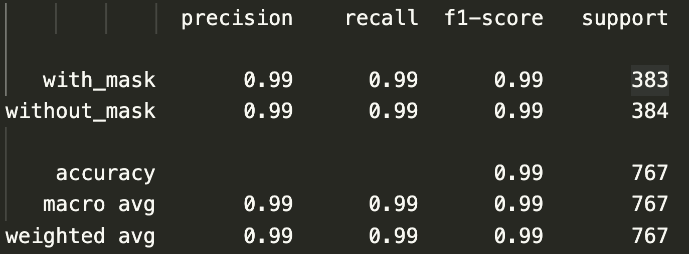
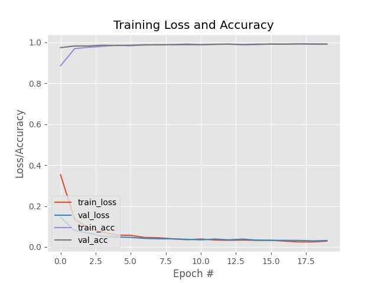

## AIM : 
The basic aim of the project is to detect the presence of a face mask on human faces on live streaming video. We have used deep learning to develop our face detector model. 

    

Alongside this, we have used basic concepts of transfer learning in neural networks to finally output presence or absence of a face mask in a video stream. 

## RESULT : 
Experimental results show that our model performs well on the test data with more than 99% precision and recall.

### Classification Report -

### Learning Plot -

